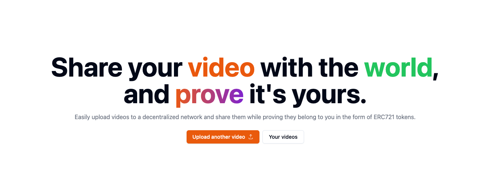

# onpeer



## Overview

onpeer is a decentralized streamable-like website to upload videos and mint them as NFTs on the Polygon blockchain.

The whole idea behind onpeer is uploading videos to a peer to peer network, like Livepeer or IPFS, but also proving that those videos have been uploaded by you, and letting others interact with them on-chain, which makes everything effectively provable and archivable.

This project is still WIP so major structural or conceptual changes might occur.

### Getting started

#### Prerequisites

- yarn & bun
- postgresql database
- thirdweb cli

```bash
# deploy the contract
# refer to thirdweb cli docs
npx thirdweb deploy

# install deps
yarn install
# generate schema types
yarn prisma:generate
# generate graphql types
yarn apollo:generate
# migrate
# make sure to fill the .env
yarn prisma:migrate

# run indexer
yarn indexer
# start app
yarn start
```

### Contract

onpeer contract has been written using solidity using the ERC721 protocol with a signature based minting is currently deployed on Polygon.

- Minting video
- Setting metadata (title, description for now)
- Liking a video
- Commenting a video (irreversible)

### Workflow

1. uploading a video to onpeer
2. onpeer will store that video using a peer to peer storage solution
3. onpeer will sign a payload and return it to the user with the signature needed to mint their specific video
4. user chooses to mint or not the video
 1. minting: video becomes persistent and interactable with
 2. not minting: video is temporarily stored on a peer to peer storage solution and deleted 24h after

### Videos and state

- Interactions, such as likes and comments, are permanently recorded on the blockchain as events in the video smart contracts.
- When minted, videos are given a token id that is calculated based on the mint metadata instead of the video itself. Therefore it is quite hard to snipe videos.

#### Indexer

The onpeer indexer operates alongside on-chain data. It watches for events and maintains an off-chain database for faster retrieval access. It also ensure immediate updates when changes are made on-chain. Like liking or commenting on a video.

### Important Notes

Unminted videos are automatically purged after 24 hours, emphasizing the necessity of minting for enduring storage.
While likes on videos are reversible, comments are irreversible and remain permanently stored.
